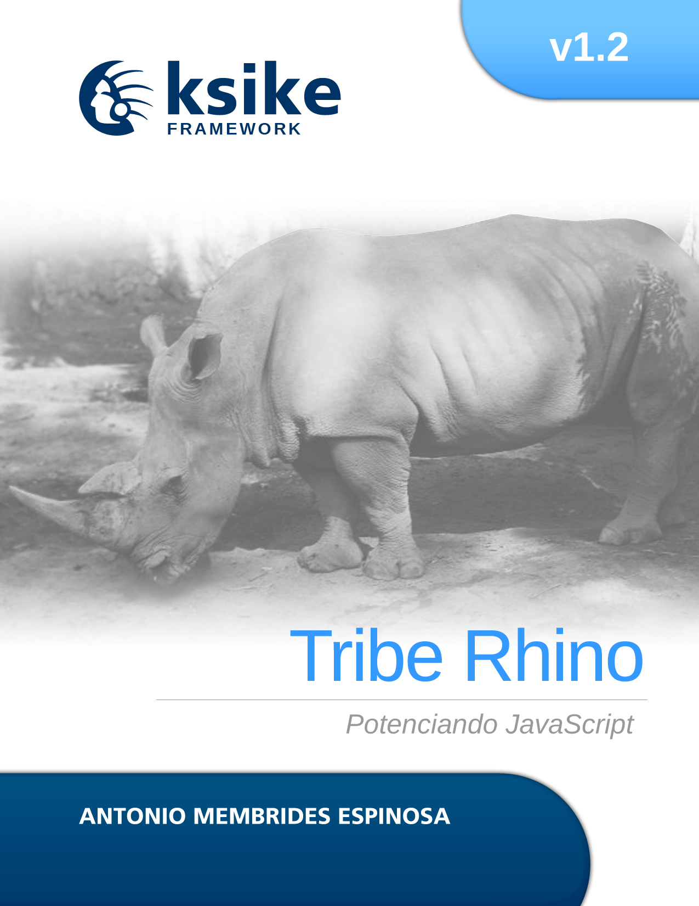

# Ksike Rhino Framework
Ksike Framework Rhino series, consists of a specialized framework for the JavaScript programming language on NodeJs, which incorporates a group of well structured architectural and design patterns, taking up the best practices of other frameworks of different technologies.

There are other editions of this framework oriented to other technologies such as PHP, JAVA, Python. The main idea is to keep the same concepts in the development of computer applications.

+ [Ksike Framework Larva](https://github.com/ameksike/ksike.larva)
+ [Ksike Framework Elephant focus on PHP](https://github.com/ameksike/ksike.elephant)
+ [Ksike Framework Elephant focus on PHP](https://github.com/ameksike/ksike.elephant)
+ [Ksike Framework focus on Java](https://github.com/ameksike/ksike.java.core.plugin)

# .............................................................

Ksike Framework serie Rhino, consiste en un marco de trabajo especializado para el lenguaje de programación JavaScript sobre NodeJs, el cual incorpora una serie de patrones arquitectónicos y de diseño bien estructurados, retomando las mejores prácticas de otros marcos de trabajo de distintas tecnologías.

